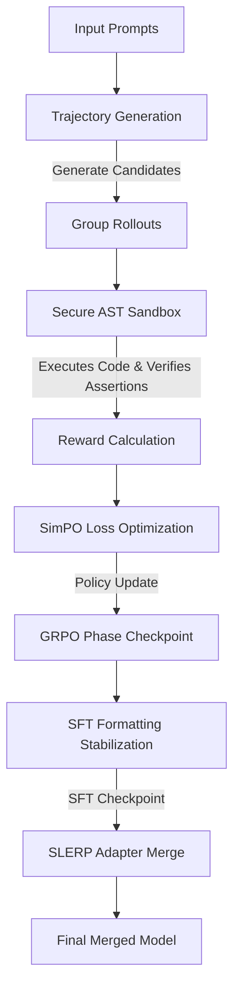

# MiniLLM AGI Co-Training Engine

This repository contains the progressive architectures and scripts developed to fine-tune the **LiquidAI LFM-2.5-230M** model on active reasoning, layout construction, self-correction, and secure code execution domains.

---

## 🏗️ System Architecture

The pipeline uses a hybrid reinforcement learning and supervised learning loop designed to align linear foundation models (LFMs) to follow complex reasoning paths and output valid, verified code.

### 1. Model Backbone
* **Model**: `LiquidAI/LFM2.5-230M-Base` (a linear state-space recurrent architecture offering highly efficient inference memory scaling).
* **PEFT**: Parameter-efficient adaptation via LoRA targeting the base model's attention-equivalent linear weights.

### 2. Dual-GPU Symmetrical co-training Loop
The training sequence consists of two primary optimization stages:
* **Stage 1: GRPO Symmetrical Alignment (Policy Refinement)**
  * **Group Rollouts**: For each problem, the current policy generates multiple trajectory candidates containing `<conscious_reflection>` thinking traces and `<dream_code>` structural blocks.
  * **Symmetrical Rewards**:
    * *Functional Reward*: Earned when generated code executes successfully inside the Sandbox and passes all unit assertions.
    * *SimPO Optimization*: Direct pairwise ranking comparing successful candidates (winners) with failing candidates (losers) using length-normalized log-probabilities and margin penalties.
    * *Consistency Constraint*: A regularization penalty ensuring the formatting output distribution doesn't drift too far from the reference structure.
* **Stage 2: Supervised Fine-Tuning (SFT) Stabilization**
  * Replays high-quality reasoning trajectories to lock in syntactic token structure (like XML tag nesting and variable output bindings).

### 3. SLERP Merge (Spherical Linear Interpolation)
Instead of relying on standard averaging, the final weights are produced by executing a **SLERP Merge** on the isolated GRPO and SFT adapter checkpoints. By interpolating weights along a spherical path ($t=0.5$), it preserves the high-dimensional geometric representations of both training stages, blending the formatting precision of SFT with the reasoning alignment of GRPO.

### 4. Secure AST Sandbox
* **AST Validation**: Code blocks are parsed into Abstract Syntax Trees to verify structure and block unsafe imports/modules before compilation.
* **Loop Limits**: Injects loop counter transformations directly into the AST structure to intercept and terminate infinite loops, protecting the runner from hanging on buggy candidate logic.

---

## 🛸 Core Pipeline Iterations (V1, V2, & V3)

The training pipeline evolved over three major iterations, transitioning from basic SFT alignment to advanced, feedback-driven co-training.

### 🧬 Version 1: SFT & GRPO Baseline
* **Code Files**: [`finetuning.py`](file:///sdcard/Download/minillm/finetuning.py) / [`finetuning.ipynb`](file:///sdcard/Download/minillm/finetuning.ipynb)
* **Goal**: Establish the fundamental policy structure for formatted reasoning outputs using `<conscious_reflection>` thought traces and `<dream_code>` structural blocks.

### ⚡ Version 2: Pref-Guided Slerp-Merged Alignment (The Baseline Run)
* **Code Files**: [`finetuning_v2.py`](file:///sdcard/Download/minillm/finetuning_v2.py) / [`finetuning_v2.ipynb`](file:///sdcard/Download/minillm/finetuning_v2.ipynb)
* **Kaggle Script**: [`kaggle_run/finetuning_v2_kaggle.py`](file:///sdcard/Download/minillm/kaggle_run/finetuning_v2_kaggle.py)
* **Training Run Details**: 
  * **Execution Mode**: Pushed and executed as a batch job on **Dual Tesla T4 GPUs** (15+ GB VRAM).
  * **Dataset**: Run on the full `dataset_small.json` (600 samples segmented into 510 training / 90 validation).
  * **Duration**: Run successfully for **9.9 hours**.
  * **Mechanics**:
    * **SimPO Preference Loss**: Direct pairwise ranking of generated candidates using sequence length normalization and configurable margins.
    * **Teacher Sandbox**: Executes Python structures in a secure runtime AST environment to output test assertion outcomes.
    * **SLERP Adapter Merge**: Linear spherical interpolation blending SFT formatting adapter weights with GRPO alignment weights.

### 🚀 Version 3: Symmetrical Co-Training & Fallback Engine
* **Code Files**: [`finetuning_v3.py`](file:///sdcard/Download/minillm/finetuning_v3.py) / [`finetuning_v3.ipynb`](file:///sdcard/Download/minillm/finetuning_v3.ipynb)
* **Kaggle Script**: [`kaggle_run_v3/finetuning_v3_kaggle.py`](file:///sdcard/Download/minillm/kaggle_run_v3/finetuning_v3_kaggle.py)
* **Advanced Features**:
  * **Dynamic Token Limits & Stopping Criteria**: Halves redundant generations using custom token closing sequence match hooks (`TagClosingStoppingCriteria`).
  * **Robust Sandbox Timeouts**: Loop-limiter AST transformations preventing runaway recursion or infinite loops from hanging execution threads.
  * **CPU Fallback Redirection**: Monkeypatches standard torch/cuda devices to automatically translate executions to CPU registers if run on legacy GPU nodes (like Tesla P100) where PyTorch standard packages crash.
  * **Automatic GGUF Compiles**: Auto-exporting standard FP16 and quantized `Q4_K_M` GGUF binaries on completion.

---

## 📂 Repository File Directory

* `finetuning_v3.py` & `finetuning_v3.ipynb`: Interactive script and Jupyter Notebook versions for the V3 co-training architecture.
* `finetuning_v2.py` & `finetuning_v2.ipynb`: Script and notebook versions for the 9.9-hour V2 setup.
* `finetuning.py` & `finetuning.ipynb`: Initial V1 baseline pipeline.
* `kaggle_run/`: Metadata and headless Python files optimized to execute V2 on Kaggle.
* `kaggle_run_v3/`: Metadata and headless Python files optimized to execute V3 on Kaggle.
* `track_kaggle.py`: API status monitor used to stream stdout/stderr lines from Kaggle batch workers in real time.
* `generate_datasets.py` & `generate_datasets_v2.py`: Synthesis utilities generating the multi-domain training distributions.

---

## ⚙️ How to Execute Finetuning Runs

### Running in Kaggle Interactive Editor (Recommended for T4 x2)
Because Kaggle's API queue can occasionally fallback to P100 instances depending on server congestion, executing inside the Interactive Web Editor is the most reliable way to lock in dual GPU acceleration.

1. Create a new notebook on the Kaggle website.
2. Select **File** -> **Upload Notebook** and choose [`finetuning_v3.ipynb`](file:///sdcard/Download/minillm/finetuning_v3.ipynb).
3. Set the active accelerator on the right panel to **GPU T4 x2**.
4. Run all cells to begin training!
